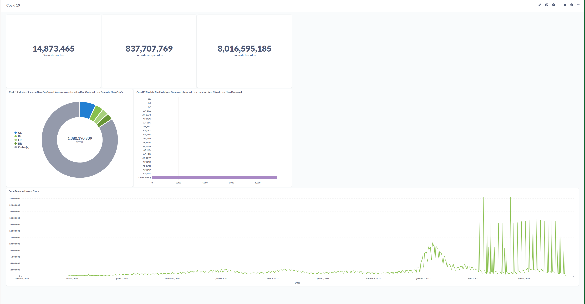

# morden-data-stack

 The idea of the project is to create a Data Engineering pipeline using a modern stack of data technologies, including Airbyte, Apache Airflow, dbt, Snowflake and Metabase.


# Abount project

## The project consists of extracting dataset data on covid19. Among them are:
- Index: Various names and codes, useful for joining with other datasets
- Demographics: Various (current³) population statistics
- Economics: Various (current³) economic indicators
- Epidemiology: COVID-19 cases, deaths, recoveries and tests

Goal is to form a single database where you will have all the data available for data analysis.

# Tool concepts:

- Airflow: Airflow is a workflow orchestration platform developed by Airbnb and currently maintained by the Apache Software Foundation. It's an open source tool designed to help manage, schedule, and monitor complex, data-dependent workflows.
In this project its use is to orchestrate the pipelines that connects with Airbyte for execution of tasks.


- Airbyte: Airbyte is an open source platform for data integration. It is designed to help companies collect, prepare, and move data from multiple sources to storage targets such as data warehouses, data lakes, and other analytics systems.

The main purpose of Airbyte is to simplify the data integration process by allowing users to set up data pipelines easily, without the need to write complex code. The platform supports a wide variety of pre-built connectors to different data sources and destinations, including databases, cloud services, SaaS applications, and more.

In this projetc its use to connect by datasets in csv to snowflake


- dbt: Dbt (data build tool) is an open source tool used for data transformation (data transformation) in data analysis projects. It is designed to help data analysts and engineers develop and manage data pipelines efficiently.
The dbt project is available in this [repository](https://github.com/GeovanniGomes/dbt_model_morden_stack)


- Metabase:  Metabase is an open source data analysis platform designed to facilitate data exploration and visualization by non-technical users. It offers a user-friendly and intuitive interface that allows users to ask questions, run queries, and create interactive dashboards without the need for advanced programming or SQL knowledge.




# Execution Guide
###### Execute in terminal
 ```
 ./setup.sh up
 ./setup.sh config
```